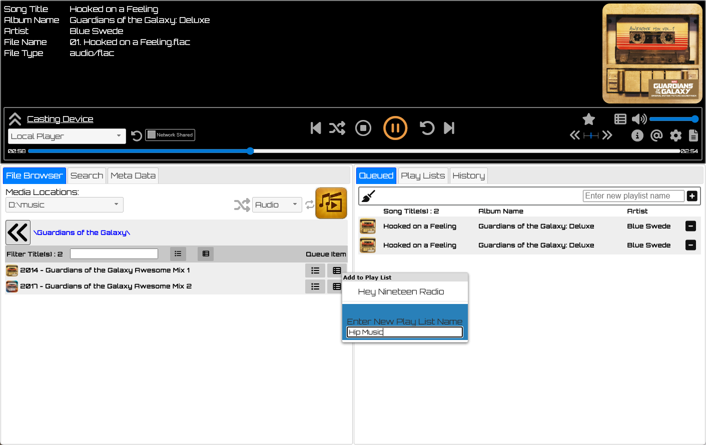
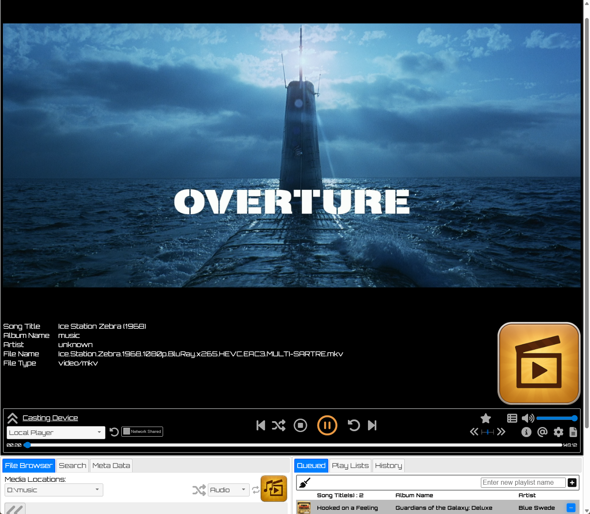

# Chrome Cast Audio Slinger : Written by Steven De Toni, 2024
The application is suitable for NAS (Network Attached Storage) servers that will allow it to 
cast audio files to Chrome Cast, DLNA, and Web Browser devices independently of your phone, tablet, or P.C.
I has the ability to cast from remote CIFS/Windows file shares as well as local files.

This service will run as a Daemon, monitoring Chrome Cast devices, and sling/cast audio, video files 
to devices from its pending queue.

## Version 0.075 Work in progress:
 * Debugged HTTP Range requests further and hopefully fix it finally.
 * Identified my DLNA issue with Metadata and Samsung T.Vs. Basically the dislike the source URL with ?query=1234 type 
   parameters within the URL. So I have implemented a dynamically generated ID HASH that references the required metadata
   in the Slinger DB and send the correct file to the DLNA device, thus getting around the complex query parameter issue
   causing confusion.

## Version 0.07 Work in progress:
 * Bug fixes for device scanning and removal of devices once no longer on the network
 * Added initial/preliminary DLNA support, will work with Kodi, but may not work with your T.V due to
   likely requiring an valid url without parameters (looking at you Samsung). This is still work in progress to get around
   this limitation.
 * Added limited video support, can play mp4, avi, mkv etc type movies, update your config to add this ability
 * Added SMB metadata retrival limit to prevent large files taking along to cast, especially appropriate for video files
 * New config settings:
```
    MATCH_MUSIC_TYPE=mkv::video/mkv
    MATCH_MUSIC_TYPE=avi::video/avi
    MATCH_MUSIC_TYPE=mp4::video/mp4
    
    # MAX 200 megs to download to extract metadata
    SMB_MAX_METADATA_SCAN_SIZE=(1024*1024)*200       
``` 

## Version 0.06 Work in progress:
 * Added in browser Config Editor
 * Added graphical UI tweaks to the playlist
 * Added Spotify Playlist loader
 * Added metadata file validation (i.e. if you delete music files then run validation to remove metadata)
 * Moved most of the Ajax calls to use POST to work around encoding GET parameters

## Version 0.05 Work in progress:
 * Added Custom temp directory location for quick RAM disk type transcoding operations.
 
## Version 0.04 Work in progress:
 * Added .dsf SACD format playback to Chromecast via conversion to FLAC 24 bit 96khz
 * Update supported **Python release** up to **3.13**
 * Fixed graphical issues

## Config Chrome Cast Slinger

You may need to set the IP address manually depending on how your systems is configured.
For Linux, it a safe to set this to 0.0.0.0 to listen on all available network devices.

**vim config/daemon.cfg**
```
# ---- Basic webserver config ----
HTTP_SERVERNAME=0.0.0.0
...
```
update to ip address of 0.0.0.0


**vim config/slinger.cfg**
```
[slinger]
    # ---- Database Settings ----
    DB_FILENAME=./config/slinger.db
    DB_VERSION=1.0
    # max time in seconds: 10 minutes
    DB_SQLEXEC_MAXTIME=600
    # max time in milli-seconds: 30 seconds
    DB_SQLLOCK_MAXTIME=30000

    # album art folder name
    ALBUM_ART_FILENAME=folder.jpg
    ALBUM_ART_FILENAME=folder.png
    ALBUM_ART_FILENAME=cover.jpg
    ALBUM_ART_FILENAME=cover.png

    # supported chromecast file type extension :: and mime/content type sent to chromecast device
    MATCH_MUSIC_TYPE=flac::audio/flac
    MATCH_MUSIC_TYPE=mp3::audio/mp3
    MATCH_MUSIC_TYPE=ogg::audio/ogg
    MATCH_MUSIC_TYPE=wav::audio/wav
    MATCH_MUSIC_TYPE=webm::audio/opus
    MATCH_MUSIC_TYPE=opus::audio/opus
    MATCH_MUSIC_TYPE=oga::audio/opus
    MATCH_MUSIC_TYPE=aac::audio/aac
    MATCH_MUSIC_TYPE=aacp::audio/aac
    MATCH_MUSIC_TYPE=3gpp::audio/aac
    MATCH_MUSIC_TYPE=3gpp2::audio/aac
    MATCH_MUSIC_TYPE=m4a::audio/aac
    
    MATCH_MUSIC_TYPE=mkv::video/mkv
    MATCH_MUSIC_TYPE=avi::video/avi
    MATCH_MUSIC_TYPE=mp4::video/mp4    
    
    # dynamic transcoding
    MATCH_MUSIC_TYPE=dsf::audio/transcode
    MATCH_MUSIC_TYPE=wv::audio/transcode

    # transcode formats using ffmpeg
    TC_FFMPEG_AUDIO_FORMAT=s32
    TC_FFMPEG_AUDIO_FREQ=96000
    TC_FFMPEG_AUDIO_OUT_FORMAT=flac

    # extra parameter used in audio
    TC_FFMPEG_OTHER_AUDIO_CFG=-af
    TC_FFMPEG_OTHER_AUDIO_CFG="lowpass=24000, volume=6dB"
    TC_FFMPEG_OTHER_AUDIO_CFG=-compression_level
    TC_FFMPEG_OTHER_AUDIO_CFG=0

    # Override ffmpeg executable location
    #TC_FFMPEG_EXE_OVERRIDE=
    #TC_FFMPEG_EXE_OVERRIDE=.\ffmpeg\bin\ffmpeg.exe
    #TC_FFMPEG_EXE_OVERRIDE=c:\ffmpeg\bin\ffmpeg.exe
    #TC_FFMPEG_EXE_OVERRIDE=/usr/bin/ffmpeg    
	
    # Transcoding file cache location.
    # This location will store previous transcoded files up to a specified directory usage,
    # then if will purge previous cached file based upon least recently used algorithm
    #TC_CACHE_LOCATION=d:\ffmpeg_cache
    TC_CACHE_LOCATION=

    # accepted formats are: nKB, nMB, nGB, nTB
    # examples : 100GB == 100 Gigabytes to limit size of cache
    #              2TB ==   2 Terabytes to limit size of cache
    TC_CACHE_MAX_SIZE=10GB
    	
    # Override temp file creating (i.e them in an RAM drive for fast I/O), by default its your OS Temp location.
    # example:
    #     mount -o size=1G -t tmpfs none /mnt/tmpfs
    # TEMP_FILE_LOCATION=/mnt/tmpfs
    TEMP_FILE_LOCATION=	

    # how long to cache chrome cast device info before re-query device info in seconds. Default 10 mins
    CHROMECAST_CACHE_TIMEOUT=600
    
    # if the song seek position fails to work, then you can disable
    # it with this option.
    DISABLE_SONG_SEEK=true    

    # Spotify API credentials to allow Slinger to read playlists and
    # match against your existing files (metadata must be fully loaded)
    SPOTIFY_CLIENT_ID=5f573c9620494bae87890c0f08a60293
    SPOTIFT_CLIENT_SECRET=212476d9b0f3472eaa762d90b19b0ba8

    # accepted formats using:
    #   <username/password>::UNC Path
    #   UNC Path \\server\Share\filename
    SMB_MUSIC_UNCPATH=::\\192.168.20.14\MediaServer\Music
    SMB_MUSIC_UNCPATH=::\\192.168.20.23\ExtUSB-4TB\music
    FILE_MUSIC_UNCPATH=D:\music\
    
    # MAX 200 megs to download to extract metadata
    SMB_MAX_METADATA_SCAN_SIZE=(1024*1024)*200       

    SEARCH_RESULT_LIMIT=1000

    # Scraper Schedular
    # Time to scrape in cron format
    # * * * * *
    # | | | | |
    # | | | | day of the week (0–6) (Sunday to Saturday;
    # | | | month (1–12)             7 is also Sunday on some systems)
    # | | day of the month (1–31)
    # | hour (0–23)
    # minute (0–59)
    #SCRAPER_EVENT_TIME=0 23 * * *
```

Set your own SMB_MUSIC_UNCPATH or FILE_MUSIC_UNCPATH
to point to your music files/folders

Add/Change folder art files and types as required.


## Make python virtual envs

**python3 -m venv ./python-slinger**

**ls -al**
```
total 64
drwxr-xr-x 8 root   root     4096 Aug 24 21:42 .
drwxr-xr-x 9 root   root     4096 Aug 24 21:31 ..
drwxrwxrwx 2 nobody nogroup  4096 Aug 24 21:35 config
drwxrwxrwx 3 nobody nogroup  4096 Aug 24 21:30 daemon
-rwxrw-rw- 1 nobody nogroup 18092 Oct 18  2023 LICENSE
drwxrwxrwx 2 nobody nogroup  4096 Aug 24 21:30 logs
**drwxr-xr-x 5 root   root     4096 Aug 24 21:42 python-slinger**
-rwxrw-rw- 1 nobody nogroup   547 Aug 24 21:26 README.md
-rwxrw-rw- 1 nobody nogroup    32 Aug  6 20:56 requirements.txt
-rwxrwxrwx 1 nobody nogroup  3328 Aug 24 21:33 runner.py
drwxrwxrwx 3 nobody nogroup  4096 Aug 24 21:30 slinger
drwxrwxrwx 3 nobody nogroup  4096 Aug 24 21:30 webapps
```

**export PATH=/opt/cc_audio_slinger/python-slinger/bin:$PATH**

**which  pip3**

```/opt/cc_audio_slinger/python-slinger/bin/pip3```

**pip3 install -r requirements.txt**

```
Looking in indexes: https://pypi.org/simple, https://www.piwheels.org/simple
Collecting pychromecast
...
Installing collected packages: ifaddr, zeroconf, urllib3, tqdm, pymediainfo, pyasn1, protobuf, idna, charset-normalizer, certifi, requests, pysmb, casttube, pychromecast
Successfully installed casttube-0.2.1 certifi-2024.7.4 charset-normalizer-3.3.2 idna-3.8 ifaddr-0.2.0 protobuf-5.27.3 pyasn1-0.6.0 pychromecast-14.0.1 pymediainfo-6.1.0 pysmb-1.2.9.1 requests-2.32.3 tqdm-4.66.5 urllib3-2.2.2 zeroconf-0.132.2
```

**cat go**

```
export PATH=/opt/cc_audio_slinger/python-slinger/bin:$PATH
echo Access Program from $(ip a  | grep inet | grep global | awk -F'/' '{print $1}' | awk '{print "http://"$2":8008"}')
python3 runner.py &
```

### Boot program
**./go**
```
21:47:13:INFO:HTTPInstances.init port:8008
21:47:13:INFO:HTTPInstances.run Starts - http://0.0.0.0:8008
21:47:13:INFO:HTTPInstances.init port:8009
21:47:13:INFO:HTTPInstances.run Starts - https://0.0.0.0:8009
```

### Access program
```echo Access Program from $(ip a  | grep inet | grep global | awk -F'/' '{print $1}' | awk '{print "http://"$2":8008"}')```

### Terminate program
**ps**
```
    PID TTY          TIME CMD
 766371 pts/0    00:00:00 bash
 766962 pts/0    00:00:00 python3
 766965 pts/0    00:00:00 ps
```

**pkill python3**

## Install as a Systemd Service

**cat cc_audio_slinger.service**
```
[Unit]
Description=Chrome Cast Audio Slinger
After=network.target

[Service]
User=pi
Group=pi
WorkingDirectory=/opt/cc_audio_slinger
ExecStart=/opt/cc_audio_slinger/python-slinger/bin/python3 runner.py
Restart=always

[Install]
WantedBy=multi-user.target
```

**sudo cp cc_audio_slinger.service /etc/systemd/system**

**sudo systemctl daemon-reload**

**systemctl start cc_audio_slinger.service**

**systemctl status cc_audio_slinger.service**
```
● cc_audio_slinger.service - Chrome Cast Audio Slinger
     Loaded: loaded (/etc/systemd/system/cc_audio_slinger.service; disabled; preset: enabled)
     Active: active (running) since Wed 2024-09-04 19:52:18 NZST; 2s ago
   Main PID: 2187 (python3)
      Tasks: 3 (limit: 3915)
        CPU: 282ms
     CGroup: /system.slice/cc_audio_slinger.service
             └─2187 python3 runner.py

Sep 04 19:52:18 detoni-services systemd[1]: Started cc_audio_slinger.service - Chrome Cast Audio Slinger.
Sep 04 19:52:19 detoni-services python3[2187]: 19:52:19:INFO:HTTPInstances.init port:8008
Sep 04 19:52:19 detoni-services python3[2187]: 19:52:19:INFO:HTTPInstances.run Starts - http://0.0.0.0:8008
Sep 04 19:52:19 detoni-services python3[2187]: 19:52:19:INFO:HTTPInstances.init port:8009
Sep 04 19:52:19 detoni-services python3[2187]: 19:52:19:INFO:HTTPInstances.run Starts - https://0.0.0.0:8009
```

## Enable startup on system reboot
**sudo systemctl enable cc_audio_slinger.service**
```Created symlink /etc/systemd/system/multi-user.target.wants/cc_audio_slinger.service → /etc/systemd/system/cc_audio_slinger.service.```


## Transcoding Exotic Formats using FFMPEG
It is now possible to transcode .dsf (SACD format) files into 24bit 96khz FLAC output. 
Depending on your system and file access, this process is completed in a few seconds.

See config settings for details. 

Note: This feature uses the pyffmpeg Python package, this may not work correctly on 
you system (i.e. this fails on Raspberry PI, and installs an x86 and not an Arm binary!).\
If this is the case with your system, install ffmpeg externally, and alter config setting *TC_FFMPEG_EXE_OVERRIDE*

Example:\
**apt install ffmpeg**\
...

**which ffmpeg***
```
/usr/bin/ffmpeg
```

Alter Config setting to new install location of ffmpeg\
``TC_FFMPEG_EXE_OVERRIDE=/usr/bin/ffmpeg``

## Screen Shots





