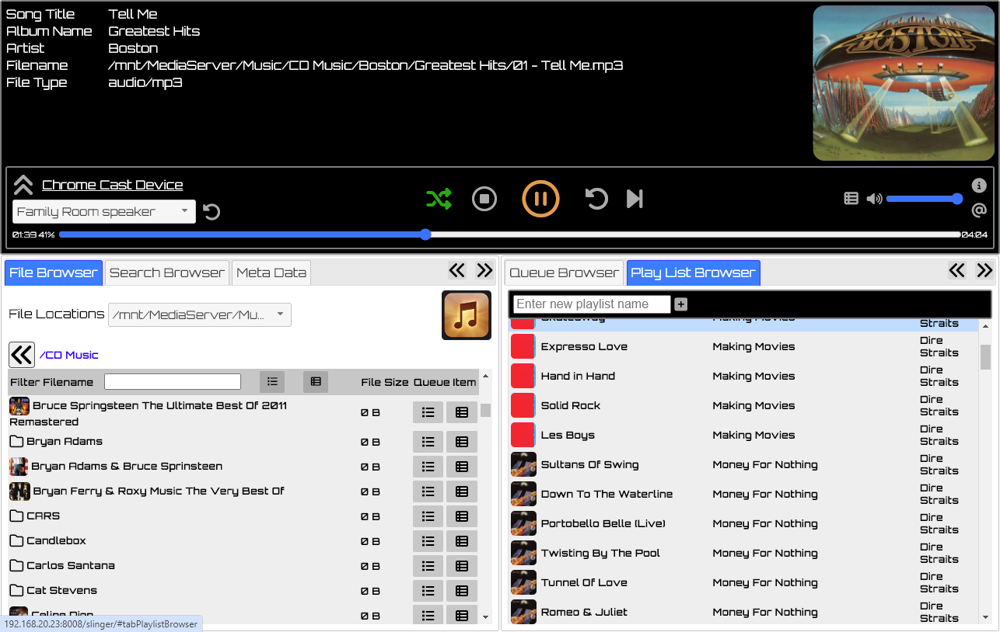
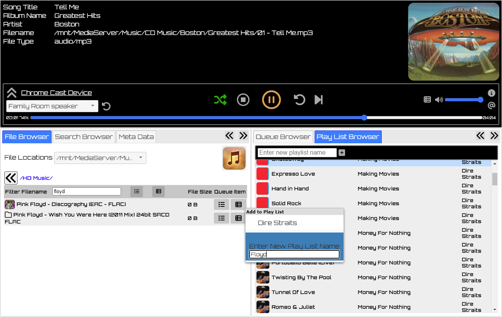

# Chrome Cast Audio SLinger : Written by Steven De Toni, 2024
The application is suitable for NAS (Network Attached Storage) servers that will allow it to 
cast audio files to Chrome Cast devices independantly of your phone, tablet, or P.C.
I has the ability to cast from remote CIFS/Windows file shares as well as local files.

This service will run as a Daemon, monitoring Chrome Cast devices, and slinger audio files 
to devices from its pending audio queue.

## Version 0.02 Work in progress:
 * Work in progress
   
## Config Chrome Cast Slinger

You may need to set the IP address manually depending on how your systems is configured.
For Linux, it a safe to set this to 0.0.0.0 to listen on all available network devices.

**vim config/daemon.cfg**
```
# ---- Basic webserver config ----
HTTP_SERVERNAME=0.0.0.0
...
```
update to ip address of 0.0.0.0


**vim config/slinger.cfg**
```
[slinger]
    # ---- Database Settings ----
    DB_FILENAME=./config/slinger.db
    DB_VERSION=1.0
    # max time in seconds: 10 minutes
    DB_SQLEXEC_MAXTIME=600
    # max time in milli-seconds: 30 seconds
    DB_SQLLOCK_MAXTIME=30000

    # album art folder name
    ALBUM_ART_FILENAME=folder.jpg
    ALBUM_ART_FILENAME=folder.png
    ALBUM_ART_FILENAME=cover.jpg
    ALBUM_ART_FILENAME=cover.png

    # supported chromecast file type extension :: and mime/content type sent to chromecast device
    MATCH_MUSIC_TYPE=flac::audio/flac
    MATCH_MUSIC_TYPE=mp3::audio/mp3
    MATCH_MUSIC_TYPE=ogg::audio/ogg
    MATCH_MUSIC_TYPE=wav::audio/wav
    MATCH_MUSIC_TYPE=webm::audio/opus
    MATCH_MUSIC_TYPE=opus::audio/opus
    MATCH_MUSIC_TYPE=oga::audio/opus
    MATCH_MUSIC_TYPE=aac::audio/aac
    MATCH_MUSIC_TYPE=aacp::audio/aac
    MATCH_MUSIC_TYPE=3gpp::audio/aac
    MATCH_MUSIC_TYPE=3gpp2::audio/aac
    MATCH_MUSIC_TYPE=m4a::audio/aac

    # how long to cache chrome cast device info before re-query device info in seconds. Default 10 mins
    CHROMECAST_CACHE_TIMEOUT=600

    # accepted formats using:
    #   <username/password>::UNC Path
    #   UNC Path \\server\Share\filename
    SMB_MUSIC_UNCPATH=::\\192.168.20.14\MediaServer\Music
    SMB_MUSIC_UNCPATH=::\\192.168.20.23\ExtUSB-4TB\music
    FILE_MUSIC_UNCPATH=D:\music\

    SEARCH_RESULT_LIMIT=1000

    # Scraper Schedular
    # Time to scrape in cron format
    # * * * * *
    # | | | | |
    # | | | | day of the week (0–6) (Sunday to Saturday;
    # | | | month (1–12)             7 is also Sunday on some systems)
    # | | day of the month (1–31)
    # | hour (0–23)
    # minute (0–59)
    #SCRAPER_EVENT_TIME=0 23 * * *
```

Set your own SMB_MUSIC_UNCPATH or FILE_MUSIC_UNCPATH
to point to your music files/folders

Add/Change folder art files and types as required.


## Make python virtual envs

**python3 -m venv ./python-slinger**

**ls -al**
```
total 64
drwxr-xr-x 8 root   root     4096 Aug 24 21:42 .
drwxr-xr-x 9 root   root     4096 Aug 24 21:31 ..
drwxrwxrwx 2 nobody nogroup  4096 Aug 24 21:35 config
drwxrwxrwx 3 nobody nogroup  4096 Aug 24 21:30 daemon
-rwxrw-rw- 1 nobody nogroup 18092 Oct 18  2023 LICENSE
drwxrwxrwx 2 nobody nogroup  4096 Aug 24 21:30 logs
**drwxr-xr-x 5 root   root     4096 Aug 24 21:42 python-slinger**
-rwxrw-rw- 1 nobody nogroup   547 Aug 24 21:26 README.md
-rwxrw-rw- 1 nobody nogroup    32 Aug  6 20:56 requirements.txt
-rwxrwxrwx 1 nobody nogroup  3328 Aug 24 21:33 runner.py
drwxrwxrwx 3 nobody nogroup  4096 Aug 24 21:30 slinger
drwxrwxrwx 3 nobody nogroup  4096 Aug 24 21:30 webapps
```

**export PATH=/opt/cc_audio_slinger/python-slinger/bin:$PATH**

**which  pip3**

```/opt/cc_audio_slinger/python-slinger/bin/pip3```

**pip3 install -r requirements.txt**

```
Looking in indexes: https://pypi.org/simple, https://www.piwheels.org/simple
Collecting pychromecast
...
Installing collected packages: ifaddr, zeroconf, urllib3, tqdm, pymediainfo, pyasn1, protobuf, idna, charset-normalizer, certifi, requests, pysmb, casttube, pychromecast
Successfully installed casttube-0.2.1 certifi-2024.7.4 charset-normalizer-3.3.2 idna-3.8 ifaddr-0.2.0 protobuf-5.27.3 pyasn1-0.6.0 pychromecast-14.0.1 pymediainfo-6.1.0 pysmb-1.2.9.1 requests-2.32.3 tqdm-4.66.5 urllib3-2.2.2 zeroconf-0.132.2
```

**cat go**

```
export PATH=/opt/cc_audio_slinger/python-slinger/bin:$PATH
echo Access Program from $(ip a  | grep inet | grep global | awk -F'/' '{print $1}' | awk '{print "http://"$2":8008"}')
python3 runner.py &
```

### Boot program
**./go**
21:47:13:INFO:HTTPInstances.init port:8008
21:47:13:INFO:HTTPInstances.run Starts - http://0.0.0.0:8008
21:47:13:INFO:HTTPInstances.init port:8009
21:47:13:INFO:HTTPInstances.run Starts - https://0.0.0.0:8009

### Access program
**echo Access Program from $(ip a  | grep inet | grep global | awk -F'/' '{print $1}' | awk '{print "http://"$2":8008"}')**

### Terminate program
**ps**
```
    PID TTY          TIME CMD
 766371 pts/0    00:00:00 bash
 766962 pts/0    00:00:00 python3
 766965 pts/0    00:00:00 ps
```

**pkill python3**

## Install as a Systemd Service

**cat cc_audio_slinger.service**
```
[Unit]
Description=Chrome Cast Audio Slinger
After=network.target

[Service]
User=pi
Group=pi
WorkingDirectory=/opt/cc_audio_slinger
ExecStart=/opt/cc_audio_slinger/python-slinger/bin/python3 runner.py
Restart=always

[Install]
WantedBy=multi-user.target
```

**sudo cp cc_audio_slinger.service /etc/systemd/system**

**sudo systemctl daemon-reload**

**systemctl start cc_audio_slinger.service**

**systemctl status cc_audio_slinger.service**
```
● cc_audio_slinger.service - Chrome Cast Audio Slinger
     Loaded: loaded (/etc/systemd/system/cc_audio_slinger.service; disabled; preset: enabled)
     Active: active (running) since Wed 2024-09-04 19:52:18 NZST; 2s ago
   Main PID: 2187 (python3)
      Tasks: 3 (limit: 3915)
        CPU: 282ms
     CGroup: /system.slice/cc_audio_slinger.service
             └─2187 python3 runner.py

Sep 04 19:52:18 detoni-services systemd[1]: Started cc_audio_slinger.service - Chrome Cast Audio Slinger.
Sep 04 19:52:19 detoni-services python3[2187]: 19:52:19:INFO:HTTPInstances.init port:8008
Sep 04 19:52:19 detoni-services python3[2187]: 19:52:19:INFO:HTTPInstances.run Starts - http://0.0.0.0:8008
Sep 04 19:52:19 detoni-services python3[2187]: 19:52:19:INFO:HTTPInstances.init port:8009
Sep 04 19:52:19 detoni-services python3[2187]: 19:52:19:INFO:HTTPInstances.run Starts - https://0.0.0.0:8009
```

## Enable startup on system reboot
**sudo systemctl enable cc_audio_slinger.service**
```Created symlink /etc/systemd/system/multi-user.target.wants/cc_audio_slinger.service → /etc/systemd/system/cc_audio_slinger.service.```

## Screen Shots




 
 
 
 
